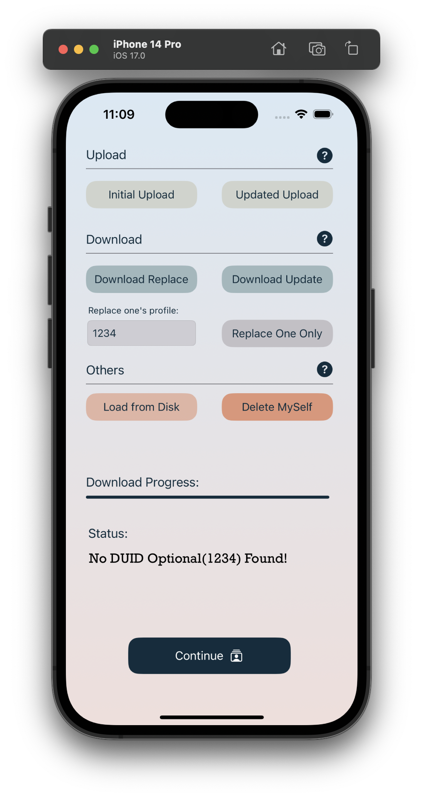

#  ECE564 HW3 - Communications

> **~For the first time running the app, it will be slow to load the launch screen, because I used RealityKit pakage.~ I have disabled those animation for a better launch speed.**

> **Please ignore some run-time warnings, they are from the BackgroundRemoval dependency. There's no errors or warning at the build-time.**


## Extra Functionality

### 1.Nice UI on main
- Very delicated and well-arranged main screen

||||
|---|---|---|

||||
|---|---|---|

### 2.Additional features on main - Help button
- Add three help buttons with pop-up help menus

### 3.Support for additional REST endpoints - entriesNetidDelete and entriesNetidGet
- Support DELETE API for removal of my profile on the server
- Support GET API for specific person using the input DUID


<br />

## Code Reference

#### 1.The Pop-up view was inspired by [@Mijick](https://github.com/Mijick/PopupView) and [@exyte](https://github.com/exyte/PopupView)

But both of these dependencies worked not as expected, so I referenced the code on StackOverflow
```swift
extension UIViewController {

func showToast(message : String, font: UIFont) {

    let toastLabel = UILabel(frame: CGRect(x: self.view.frame.size.width/2 - 75, y: self.view.frame.size.height-100, width: 150, height: 35))
    toastLabel.backgroundColor = UIColor.black.withAlphaComponent(0.6)
    toastLabel.textColor = UIColor.white
    toastLabel.font = font
    toastLabel.textAlignment = .center;
    toastLabel.text = message
    toastLabel.alpha = 1.0
    toastLabel.layer.cornerRadius = 10;
    toastLabel.clipsToBounds  =  true
    self.view.addSubview(toastLabel)
    UIView.animate(withDuration: 4.0, delay: 0.1, options: .curveEaseOut, animations: {
         toastLabel.alpha = 0.0
    }, completion: {(isCompleted) in
        toastLabel.removeFromSuperview()
    })
} }

```


<br />

## Usage

### Main Page Help

```text
-- Initial Upload --
Upload your data to the server from the build-in JSON file

-- Updated Upload --
Update your remote profile with your local changes

-- Download Replace --
Clear your local data model, and fetch the entire records from the server

-- Download Update --
Merge your local data model with remote data

-- Replace One Only --
Replace your local specific one's profile with remote one

-- Load from Disk --
Discard all data in memory, and sysnc with local sandbox's data

-- Delete Myself --
Delete your profile from the server
```

### Input Instruction

```text
--------------------------------------- Help ---------------------------------------
Format:
fn=first_name, ln=last_name, em=email,
ro=role, ge=gender, fr=from
- ro must be one of: Student, TA, Professor, Staff, or will be Other
- ge must be one of: Male, Female, otherwise will be Other
- Either of these parameters must not contains ',', space, or '='
- The order of parameters does not matter

1. Add: Add a person to the database.
    DUID is required, all other parameters are optional.
2. Update: Update or add a person with given DUID.
    DUID is required, all other parameters are optional.
3. Delete: Delete a person with given DUID.
    DUID is required, all other parameters are ignored.
4. Find: Find a person with given DUID or given name.
    Either DUID or lName is required, fName is default with "*".
    Use "*" to represent any name. Not case sensitive.
5. List All: List all people in the database.
6. Help: Show this help message.

CopyRight: Yadong (Hugo) Hu, 2023
------------------------------------------------------------------------------------
```

### Test Cases

Please visit last homework's [README.md](https://gitlab.oit.duke.edu/yh342/ece564hw1/-/blob/main/README.md) for more details.

